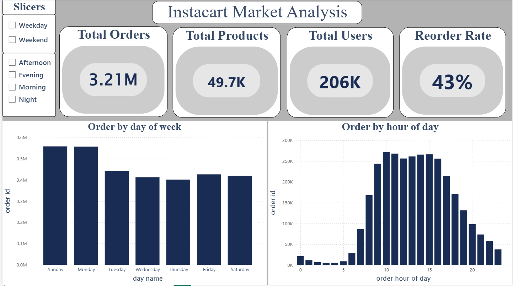
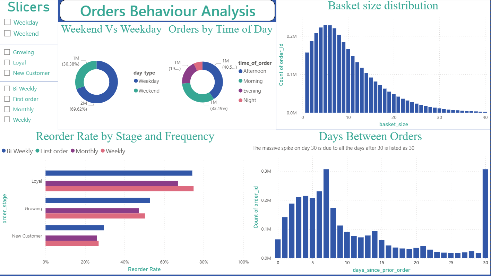
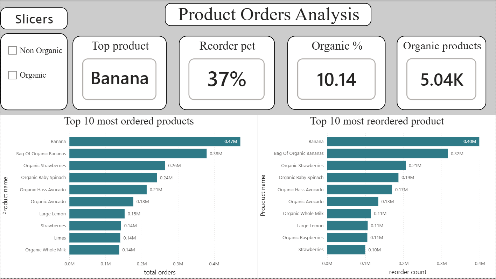
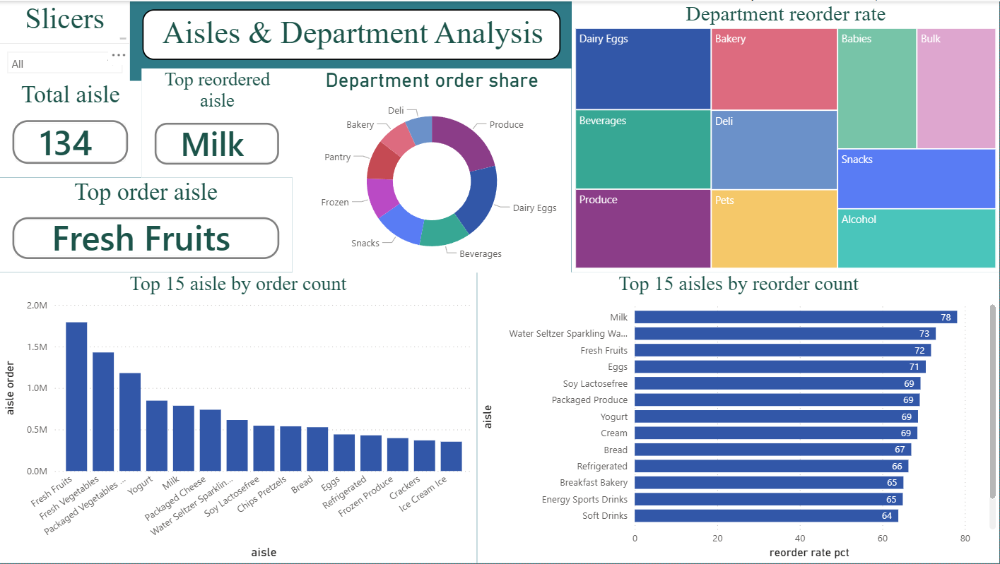
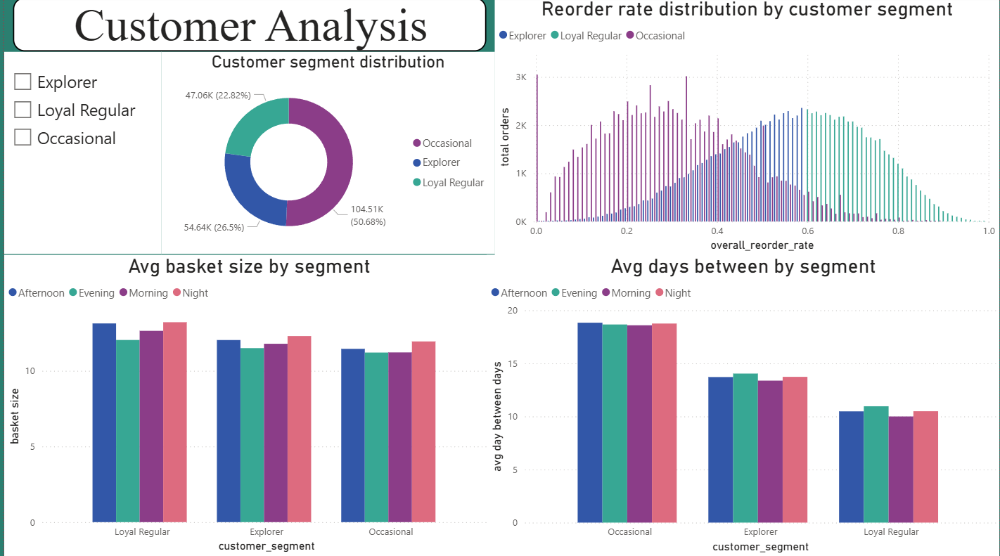

# Instacart Market Basket Analysis

# Instacart Market Basket Analysis

An end-to-end data analysis project on 3M+ rows of real Instacart grocery order data. The project covers the complete data workflow — from raw CSV files to a PostgreSQL database, through Python-based cleaning and feature engineering, SQL business analysis, and a 5-page interactive Power BI dashboard.The analysis uncovers customer shopping behaviour, reorder patterns, peak order times, product popularity, and customer segmentation across 206,000+ users and 49,000+ products.

## Technologies


## Dashboard Preview
## Page 1
 
## Page 2

## Page 3

## Page 4

## Page 5


---

## Tools Used

| Tool | Purpose |
|---|---|
| PostgreSQL | Database storage and schema setup |
| Python (pandas) | Data cleaning and feature engineering |
| SQL | Business analysis queries |
| Power BI | Dashboard and visualisation |

---

## Dataset

Source: [Instacart Market Basket Analysis — Kaggle](https://www.kaggle.com/competitions/instacart-market-basket-analysis/data)

Download the following files and place them inside the `data/` folder:

- `orders.csv`
- `products.csv`
- `aisles.csv`
- `departments.csv`
- `order_products__prior.csv`

> The `data/` folder is excluded from this repository via `.gitignore` due to file size.

---

## Project Structure

```
instacart-market-analysis/
│
├── README.md
├── .gitignore
├── requirements.txt 
├── LICENSE
│
├── data/                          # Raw CSVs (not pushed to GitHub)
│
├── database/
│   ├── generate_schema.py         # Auto-reads CSVs and generates SQL
│   └── schema.sql                 # Output from generate_schema.py
│
├── notebooks/
│   ├── 01 : eda_cleaning.ipynb      # Exploratory analysis and data cleaning
│   ├── 02 : feature_engineering.ipynb
│   ├── 03 : order_analysis.ipynb
|   ├── 04 : product_analysis.ipynb
|   ├── 05 : customer_analysis.ipynb
|
│
└── dashboard/
    └── screenshots  # dashbord png
did not upload power bi file due to large size
```

---

## How to Run This Project

### Step 1 — Set up the database

1. Download the dataset from Kaggle and place CSVs in `data/`
2. Run the schema generator:
   ```
   python database/generate_schema.py
   ```
3. Copy the terminal output and paste it into PostgreSQL query editor (pgAdmin)
4. Run the SQL — tables are created and data is loaded automatically

### Step 2 — Run the notebooks

Open notebooks in order:
```
notebooks/eda_cleaning.ipynb
notebooks/feature_engineering.ipynb
notebooks/product_analysis.ipynb
notebooks/order_analysis.ipynb
notebooks/customer_analysis.ipynb

``` 

### Step 3  — View the dashboard

Open `dashboard/` in repository.

Screenshots are available in `dashboard/` and only screenshots are uploaded due to large size of pbix file

---

## Key Findings

- **Peak ordering days:** Sunday and Monday have the highest order volume 
  with 550K+ orders each
- **Peak ordering hour:** 10am–3pm accounts for the majority of all orders
- **Most ordered product:** Banana with 470K orders, followed by 
  Bag of Organic Bananas at 380K
- **Most reordered aisle:** Milk at 78% reorder rate — highest of all 134 aisles
- **Top aisle by volume:** Fresh Fruits with 1.79M orders
- **Overall reorder rate:** 43% of all items in an order are reorders
- **Organic products:** 10.14% of all products are organic but have a 
  higher reorder rate than non-organic
- **Customer segments:** 50.68% Occasional shoppers, 26.5% Explorers, 
  22.82% Loyal Regulars
- **Loyal Regular behaviour:** Shop every 10 days on average with 71% reorder rate
- **Occasional behaviour:** Shop every 18 days on average with 30% reorder rate
- **Top department:** Produce with 19% of all order volume
- **Dairy Eggs** has the highest reorder rate among all departments at 67%


---

## Setup

Install Python dependencies:

```
pip install pandas sqlalchemy psycopg2-binary jupyter
```

Or using the requirements file:

```
pip install -r requirements.txt
```

---

## Author

**Varun Dadhwal**
[LinkedIn](https://linkedin.com/in/varundadhwal) · [GitHub](https://github.com/VARUNDADHWAL) · [Kaggle](https://www.kaggle.com/varundadwal)# Instacart_market_analysis
